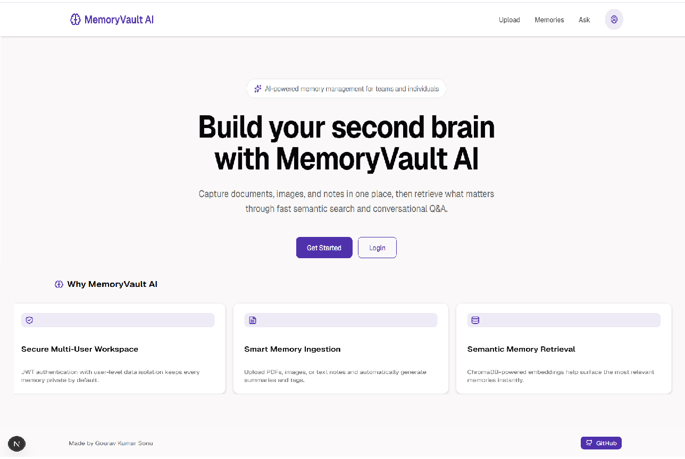
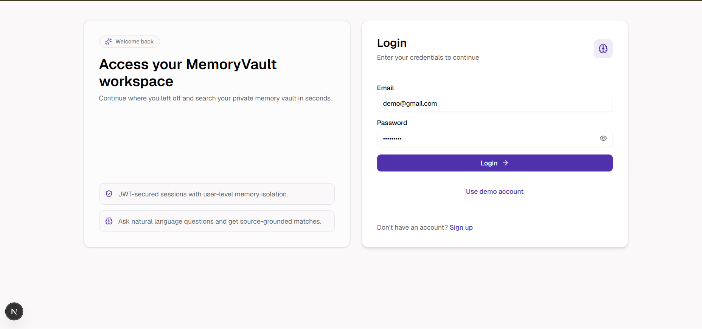
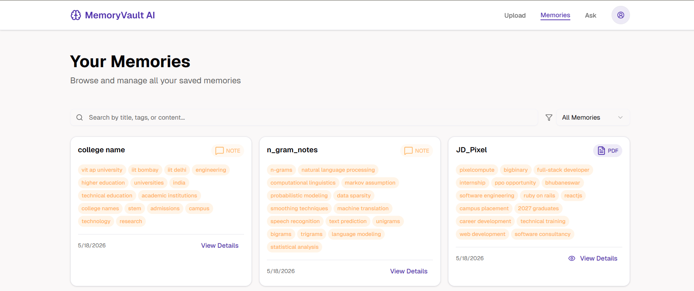
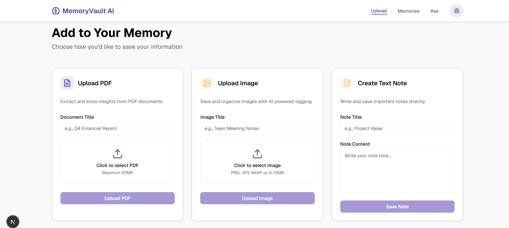
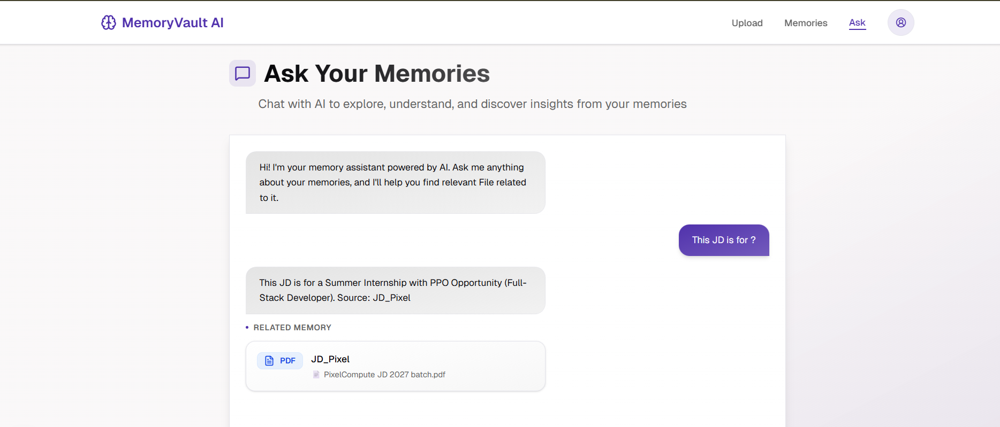

# MemoryVault AI

MemoryVault AI is a personal/team knowledge management app that captures documents, images, and notes, and makes them searchable via semantic embeddings and conversational Q&A. It combines a lightweight FastAPI backend, a Chroma vector store, MongoDB for metadata persistence, and a Next.js frontend for a polished UI.

> NOTE: This README explains the codebase structure, critical design decisions, how to run the project locally, deployment hints, and troubleshooting steps.

---

## What it is

- A private memory vault for storing text notes, PDFs, and images.
- Automatically extracts text, generates summaries/tags, and indexes content using embeddings.
- Provides a conversational Ask interface (RAG) that returns grounded answers with clickable sources that open the original memory detail view.

## Problem it solves

- Organizes scattered knowledge (notes, screenshots, PDFs) into a single searchable place.
- Enables semantic search and natural-language Q&A across your own data.
- Helps teams or individuals recall previously captured information quickly without manual searching.

## Key features

- Upload PDFs, images and text notes with automatic OCR/extraction.
- Embedding-based semantic search (ChromaDB) and conversational QA (RAG using a chat model).
- Per-user isolation and JWT-secured sessions.
- Memory detail modal with source text, tags, summary, and metadata.
- Reindexing utilities to rebuild the vector store from MongoDB.

## Tech stack

- Backend: FastAPI (Python)
- Vector store: ChromaDB
- Metadata store: MongoDB
- Frontend: Next.js (app router), React, TypeScript
- Embeddings & chat: configured for Google Gemini (via google.genai SDK) by default
- Optional: Hugging Face Inference API as an alternative for embeddings

## Project layout (top-level)

- `backend/` — FastAPI app, services, routes, DB helpers, and utility scripts
  - `app/` — application package (routes, services, config)
  - `reindex_chroma_from_mongo.py` — rebuild chroma from Mongo
  - `reset_chroma.py` — reset chroma store
  - `Dockerfile` — backend container
- `frontend/` — Next.js app (React + TypeScript), UI components
- `render.yaml` — Render deploy configuration
- `chroma_store/` — local Chroma files (if running locally)

---

## Critical design decisions

- Gemini (Google AI Studio) was chosen for embeddings and chat because it requires no local transformer runtime (no Torch/runtime in the host). This simplifies hosting (no GPU or heavy CPU requirements).
- ChromaDB chosen as an embeddable, local-friendly vector store to persist vectors and support fast retrieval.
- MongoDB stores memory metadata and original content (extracted text). Reindexing uses Mongo to repopulate Chroma.
- Frontend uses a `MemoryDetailModal` component that expects `extractedText` to be present in the API response; the `/ask` endpoint must include `extractedText` on matched memories to let the modal show the original note.
- The repo includes utilities to reindex vectors when switching embedding models — changing models requires reindexing for consistency.

Design trade-offs & notes
- Gemini: zero infra overhead but uses API quotas and keys; if you prefer open-source models, you can switch to Hugging Face embeddings (requires reindexing and may have different vector dims).
- Mixing embedding dims between models is not recommended — always reindex after switching embedding models.

---

## Screenshots

Below are sample screenshots showing key parts of the UI. Open the images in the `docs/` folder for full-size views.

Homepage



Login page



Memory detail (note view)



Upload flow



Ask / conversational UI



---

## Demo account (quick access)

For development/demo purposes you can use the built-in demo account on the frontend login page autofill:

- Email: `demo@gmail.com`
- Password: `demo@1234`

---

## Environment variables

The backend reads configuration from environment variables (see `backend/app/config.py`). Important vars include:

- `MONGODB_URI` — Your MongoDB connection string
- `GEMINI_API_KEY` — Google AI Studio API key (used for Gemini embeddings & chat)
- `GEMINI_CHAT_MODEL` — Chat model (e.g. `gemini-3-flash-preview`)
- `EMBEDDING_MODEL` — Embedding model name (default in repo: `gemini-embedding-001`)
- `NEXT_PUBLIC_API_BASE_URL` — Frontend API base URL (frontend rewrites /api/* to backend)

If you switch embedding providers (Hugging Face), you may add:

- `HF_API_KEY` — Hugging Face API key
- `EMBEDDING_PROVIDER` — `gemini` or `huggingface` (if you add provider switching in code)

---

## Local setup (backend)

1. Create a Python virtual environment and install dependencies:

```bash
cd backend
python -m venv .venv
# Windows: .venv\Scripts\activate
# Unix/macOS: source .venv/bin/activate
pip install -r requirements.txt
```

2. Set environment variables (example on macOS/Linux):

```bash
export MONGODB_URI="mongodb://localhost:27017/memoryvault"
export GEMINI_API_KEY="your_gemini_api_key"
export EMBEDDING_MODEL="gemini-embedding-001"
```

On Windows PowerShell:

```powershell
$env:MONGODB_URI = "mongodb://localhost:27017/memoryvault"
$env:GEMINI_API_KEY = "your_gemini_api_key"
```

3. Start the backend (development):

```bash
# from backend/
uvicorn app.main:app --reload --host 0.0.0.0 --port 8000
```

4. Run utility scripts as needed:

- `python reindex_chroma_from_mongo.py` — rebuild Chroma vectors from Mongo (useful after switching embedding models)
- `python reset_chroma.py` — reset the local Chroma store

---

## Local setup (frontend)

1. Install dependencies and run the dev server:

```bash
cd frontend
npm install    # or pnpm install / yarn
npm run dev    # or pnpm dev
```

2. The frontend uses a rewrite to route `/api/*` to the backend. Confirm `NEXT_PUBLIC_API_BASE_URL` if you're running backend on another port.

---

## Running with Docker

A `backend/Dockerfile` is included — you can build and run the backend in a container. You may combine this with a separate deployment for the frontend.

---

## Deployment notes

- `render.yaml` contains an example Render service setup with environment variables mapped. Render's free tier may have limits for heavy embedding usage; if you rely on a large embedding/chat model, consider using Hugging Face Endpoints or a paid provider.
- If migrating from Gemini to Hugging Face embeddings, reindex your Chroma store to ensure consistent vector dimensionality.

---

## Troubleshooting

- Missing note text in Ask results: ensure `backend/app/routes/ask.py` serializes `extractedText` for matched memories. The frontend modal expects that field.
- Embedding errors: verify `GEMINI_API_KEY` (or `HF_API_KEY`) is set and the requested model exists.
- Vector dimension mismatch: if you switch embedding models, run `reindex_chroma_from_mongo.py` to rebuild vectors.
- Build errors referencing icons or missing exports (e.g., `GitHub` vs `Github`): check the correct named exports in `lucide-react` and update imports.

---

## Contributing

- Please open issues or PRs against this repository. When changing the embedding provider or embedding model, include reindex guidance and a small migration guide.

---

## Next improvements / TODO ideas

- Add a provider-agnostic embedding abstraction with a clear switch in `backend/app/config.py`.
- Add batch/queued embedding ingestion to avoid rate-limiting on hosted inference APIs.
- Add CI checks and a Github Actions workflow for linting/tests.

---

If you want, I can:

- Add a `docs/` folder with the sample screenshots and an architecture diagram.
- Generate example `docker-compose` for local dev (Mongo + backend + frontend).
- Add a short `CONTRIBUTING.md` and issue templates.

